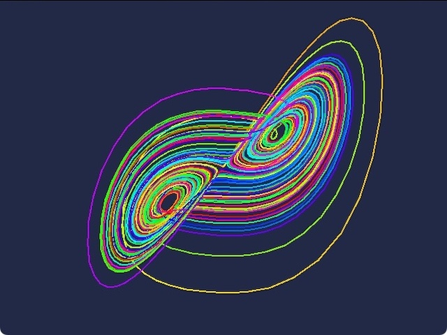

# Linien

## Anschauliche Mathematik: Die Schmetterlingskurve

Seit den Tagen meiner ersten Programmierversuche in den 1980er Jahren auf meinem damals hochmodernen, 8 MHZ schnellen [Atari Mega ST&nbsp;2](https://de.wikipedia.org/wiki/Atari_ST) mit [Modula-2](https://de.wikipedia.org/wiki/Modula-2) ist die [Schmetterlingskurve](https://en.wikipedia.org/wiki/Butterfly_curve_(transcendental)) eines meiner bevorzugten computergraphischen Objekte. Auch im *Schockwellenreiter* tauchte sie schon mehrfach auf, einmal im [April 2014 realisiert mit Python und Tkinter](http://blog.schockwellenreiter.de/essays/tkinter01.html) und eimal im [Januar 2017 programmiert mit Processing.py](http://blog.schockwellenreiter.de/2017/01/2017011804.html). Was liegt also näher, sie nun auch einmal in [TigerJython](http://cognitiones.kantel-chaos-team.de/programmierung/python/tigerjython.html) zu realisieren?

Die Kurve wurde erstmals 1989 von *Temple H. Fay* entdeckt. Sie wird in Polarkoordinaten beschrieben und ihre Formel ist

$$
\rho=e^{\cos(\theta)}-2\cdot \cos(4\cdot \theta)+\sin(\tfrac{\theta}{12})^5
$$

oder in Python-Code:

~~~python
r = exp(cos(theta)) - 2*cos(4*theta) + (sin(theta/12))**5
~~~

In TigerJython sieht das dann so aus:

~~~python
import gpanel as gp
import math, colorsys

WIDTH  = 640
HEIGHT = 480

theta = xOld = yOld = 0.0
hue = 0.0

gp.makeGPanel(gp.Size(WIDTH, HEIGHT))
gp.window(0, WIDTH, HEIGHT, 0)
gp.windowPosition(1200, 50)
gp.bgColor(gp.Color(33, 41, 70))    # (42, 40, 45)
gp.title("Schmetterlings-Kurve")

gp.lineWidth(2)
while theta < 75.39:
    c = colorsys.hsv_to_rgb(hue, 1.0 - hue, 1.0)
    gp.setColor(c)
    r = math.exp(math.cos(theta)) - 2*math.cos(4*theta) + (math.sin(theta/12))**5
    # aus Polarkoordinaten konvertieren
    x = r*math.cos(theta)
    y = r*math.sin(theta)
    # auf Fenstergröße skalieren
    xx = (x*60) + WIDTH//2 - 50
    yy = (y*60) + HEIGHT//2
    if (theta == 0.0):
        gp.move(xx, yy)
    else:
        gp.draw(xx, yy)
    theta += 0.02
    hue = theta/100
print("I did it, Babe!")
~~~

Um die Kurve optisch aufzuhübschen, habe ich -- wie [hier schon einmal beschrieben](http://blog.schockwellenreiter.de/2022/10/2022100901.html) -- das [Colorsys-Modul](https://docs.python.org/3/library/colorsys.html) verwendet, das Teil der Python-Standard-Bibliothek ist, und mit

~~~python
c = colorsys.hsv_to_rgb(hue, 1.0 - hue, 1.0)
~~~

den [HSV-Farbraum](https://de.wikipedia.org/wiki/HSV-Farbraum) statt des normal in TigerJython genutzten RGB-Farbraums genutzt. Denn das HSV-Modell ist für die meisten Menschen viel anschaulicher als der RGB-Farbraum und bietet viele Möglichkeiten, sich zum Beispiel bunte Farbaletten für die Darstellung von Fraktalen zurechtzubasteln.

### Literatur

- Stan Wagon: *Mathematica® in Aktion*, Heidelberg (Spektrum Akademischer Verlag) 1993
- Temple H. Fay: *The Butterfly Curve*, American Math. Monthly, 96(5); 442-443
- Clifford A. Pickover: *Mit den Augen des Computers. Phantastische Welten aus dem Geist der Maschine*, München (Markt&Technik) 1992, S. 41ff.

Die Kurve ist ein guter Einstieg, um von hier aus über die [Lorenz-Kurve](https://de.wikipedia.org/wiki/Lorenz-Attraktor) zu den im letzten Beitrag erwähnten iterativen Fraktalen und seltsamen Attraktoren überzuleiten.

## Der Lorenz-Attraktor, eine weitere Ikone der Chaos-Theorie

Das Abenteuer [TigerJython](http://cognitiones.kantel-chaos-team.de/programmierung/python/tigerjython.html) geht weiter, heute mit einer Ikone der Chaos-Forschung, dem [Lorenz-Attraktor](https://de.wikipedia.org/wiki/Lorenz-Attraktor). Als einer der ersten hatte 1961 *[Edward N. Lorenz](http://de.wikipedia.org/wiki/Edward%20N.%20Lorenz)*, ein Meteorologe am [Massachusetts Institute of Technology](http://de.wikipedia.org/wiki/Massachusetts%20Institute%20of%20Technology) (MIT), erkannt, daß Iteration Chaos erzeugt. Er benutzte dort einen Computer, um ein einfaches nichtlineares Gleichungssystem zu lösen, das ein simples Modell der Luftströmungen in der Erdatmosphäre simulieren sollte. Dazu benutzte er ein System von sieben Differentialgleichungen, das *Barry Saltzman* im gleichen Jahr aus den [Navier-Stokes-Gleichungen](http://de.wikipedia.org/wiki/Navier-Stokes-Gleichungen)[^1] hergeleitet hatte. Für dieses System existierte keine analytische Lösung, also mußte es numerisch (das hieß wie damals und auch heute noch vielfach üblich in FORTRAN) gelöst werden. Lorenz hatte entdeckt, daß bei nichtperiodischen Lösungen der Gleichungen vier der sieben Variablen gegen Null strebten. Daher konnte er das System auf drei Gleichungen reduzieren:

[^1]: Eine sehr schöne Einführung in das [ungelöste Problem der Navier-Stokes-Gleichungen](http://scienceblogs.de/astrodicticum-simplex/2017/01/20/sternengeschichten-folge-217-das-ungeloeste-problem-der-navier-stokes-gleichungen/) findet Ihr bei *Florian Freistetter* in der 217. Folge seiner Sternengeschichten

$$
\begin{aligned}
\frac{dx}{dt} &= -\sigma (y - z) \\
\frac{dy}{dt} &= (\rho - z)x - y \\
\frac{dz}{dt} &= xy - \gamma z
\end{aligned}
$$

Dabei sind $\sigma = -10$, $\rho = 40$ und $\gamma = - \frac{8}{3}$. Die Parameter der Gleichung habe ich *Herm1994*[^2] entnommen, *Stew1993*[^3] gibt $\rho = 28$ an, aber der Wert ändert nichts an dem Verhalten der Kurve und $\rho = 40$ füllt das Fenster einfach besser aus.&nbsp;😜

[^2]: Dietmar Herrmann: *Algorithmen für Chaos und Fraktale*, Bonn (Addison-Wesley) 1994, S. 80ff.
[^3]: Ian Stewart: *Spielt Gott Roulette?* Frankfurt (Insel TB) 1993, S. 141ff.

Nach ersten Läufen gab Lorenz die Anfangswerte nicht mehr sechstellig (das war damals der FORTRAN-Standard), sondern nur noch dreistellig ein, da er der Meinung war, daß eine Abweichung von unter einem Promille keine Bedeutung habe.

Dabei entdeckte er, daß diese Lösung nur noch in den Anfangswerten mit der Lösung der sechsstelligen Eingabe übereinstimmte. Alle weiteren Werte liefen beträchtlich auseinander. Lorenz grundlegende Erkenntnis war, daß dieses Phänomen kein Computerfehler, sondern eine prinzipielle Eigenschaft nichtlinearer Gleichungssysteme sei. Schon die geringeste Änderung in den Anfangsbedingungen kann eine komplett andere Lösung hervorbringen. Diese Beobachtung ging später als »[Schmetterlingseffekt](http://de.wikipedia.org/wiki/Schmetterlingseffekt)« *(»Der Schlag eines Schmetterlingsflügels in Brasilien kann einen Tornado über Texas hervorrufen.«)* in die Geschichte der [Chaostheorie](http://de.wikipedia.org/wiki/Chaostheorie) ein.

Da TigerJython keine eingebaute Bibliothek zur numerischen Lösung von Differentialgleichungen besitzt, habe ich das einfache [Eulersche Polygonzugverfahren](https://de.wikipedia.org/wiki/Explizites_Euler-Verfahren) zur numerischen Berechnung herangezogen

~~~python
dx = -sigma*(x - y)*dt
dy = (x*(r - z) - y)*dt
dz = (x*y - b*z)*dt
x += dx
y += dy
z += dz
~~~

und dabei konstant `dt = 0.01` gesetzt. Das benötigt natürlich mehr Rechenkapazität, als sie Lorenz je zur Verfügung standen, aber trotz der größeren Genauigkeit ändert sich nichts am chaotischen Verhalten der Kurve. Für die Farbberechnung habe ich dieses mal nur den Farbwert (`hue`) bei jeder Iteration geändert, Sättigung und Helligkeit bleiben konstant auf dem höchsten Wert. Das ergibt kräftige Farben, die von Rot über Orange nach Gelb und dann über Grün, Blau und Violett wieder zurück nach rot wandern. So kann man schön erkennen, daß die beiden »Flügel« des Attraktors immer wieder, aber für uns unvorhersehbar, durchlaufen werden.

Um das zu verdeutlichen, habe ich mit

~~~python
hue = ((20*t)%100)/100.0
c = colorsys.hsv_to_rgb(hue, 1.0, 1.0)
~~~

ein wenig getrickst, damit der Farbbereich in Abhängigkeit von den Iterationsschritten der Schleife schneller und gegebenenfalls mehrfach durchlaufen wird.

Außerdem wollte ich, daß sich der Attraktor langsam aufbaut, damit Ihr die Entstehung der Kurve nachvollziehen könnt. Normalerweise zeichnet TigerJython alles sofort nach der Berechnung auf den Bildschirm, das heißt der Lorenz-Attraktor ist komplett schon nach Sekundenbruchteilen auf dem Monitor zu sehen. Eine schnelle Lösung wäre, bei jedem Iterationsschritt mit `delay(ms)`[^4] eine Pause zu erzwingen. Das führt jedoch zu einem Flackern des Bildschirms. Dem kann man wiederum entgehen, indem man das Neuzeichnen in einem Hintergrundspeicher *(Bildbuffer)* ausführt und dann erst das fertige Bild in einem Schritt auf den Monitor herausrendert. Dieses Verfahren nennt man **Doppelbufferung**. Bei Animationen wird daher das automatische Rendern der einzelnen Graphikbefehle mit `enableRepaint(False)` deaktiviert und der Bildbuffer zum geeigneten Zeitpunkt mit `repaint()` gerendert.

[^4]: Der Parameter `ms` steht für Millisekunden.

~~~python
gp.enableRepaint(False)

while(True):
    # Berechne und zeichne das Bild im Hintergrundspeicher
    gp.repaint() # Zeichne das fertige Bild auf den Monitor
    gp.delay(5)  # Fünf Millisekunden Pause
    # …
~~~

Zu guter Letzt ist noch das Problem zu lösen, daß sich der klassische Lorenz-Attraktor aus drei unabhängigen Variablen zusammensetzt, TigerJythons *GPanel* aber nur zweidimensional Graphiken darstellen kann. Eine weitverbreitete Methode, dies zu lösen, ist, immer nur zwei Ebenen darzustellen. Angefangen habe ich mit der Darstellung des Attraktors in der x-z-Ebene:

Bei der Skalierung auf die Fenstergröße habe ich ein wenig geschummelt, um das Fenster jeweils bestmöglich auszufüllen. Für die x-z-Ebene habe ich diese Parameter genutzt:

~~~python
xx = (x*8) + 320
zz = 470 - (z*5.5)
    if (t == 0.0):
        gp.move(xx, zz)
    else:
        gp.draw(xx, zz)
~~~

In der y-z-Ebene waren es dann diese Parameter:

~~~python
yy = (y*7) + 320
zz = 470 - (z*5.5)
    if (t == 0.0):
        gp.move(yy, zz)
    else:
        gp.draw(yy, zz)
~~~

Und in der x-y-Ebene fand ich dann, daß diese Skalierungsparameter das Bildschirmfenster optimal ausfüllten:

~~~python
xx = (x*8) + 320
yy = 240 - (y*5)
    if (t == 0.0):
        gp.move(xx, yy)
    else:
        gp.draw(xx, yy)
~~~

Denn nicht nur das Hirn, sondern auch das Auge soll sich schließlich an den Ergebnissen erfreuen können. Dafür nimmt man dann schon einmal eine kleine Schummelei in Kauf.&nbsp;🤓

Jetzt aber den kompletten Quellcode, damit Ihr auch alles nachvollziehen, nachprogrammieren, aber auch erweitern und ausbauen könnt:

~~~python
import gpanel as gp
import math, colorsys

WIDTH  = 640
HEIGHT = 480

sigma = -10.0
rho   = 40.0
gamma = 8.0/3
x = y = z = 0.01
t = hue = 0.0
dt = 0.01

gp.makeGPanel(gp.Size(WIDTH, HEIGHT))
gp.window(0, WIDTH, HEIGHT, 0)
gp.windowPosition(1200, 50)
gp.bgColor(gp.Color(33, 41, 70))
gp.title("Lorenz-Attraktor, x-z-Ebene")

gp.enableRepaint(False)

gp.lineWidth(2)
while t < 74.9:
    c = colorsys.hsv_to_rgb(hue, 1.0, 1.0)
    gp.setColor(c)
    # Euler-Integration
    dx = sigma*(x - y)*dt
    dy = (x*(rho - z) - y)*dt
    dz = (x*y - gamma*z)*dt
    x += dx
    y += dy
    z += dz
    # auf Fenstergröße skalieren
    # Skalierungsparameter für die Fenstergröße:
    # x-z-Ebene: xx = (x*8) + 320, zz = 470 - (z*5.5)
    # y-z-Ebene: yy = (y*7) + 320, zz = 470 - (z*5.5)
    # x-y-Ebene: xx = (x*8) + 320, yy = 240 - (y*5)
    xx = (x*8) + 320
    zz = 470 - (z*5.5)
    if (t == 0.0):
        gp.move(xx, zz)
    else:
        gp.draw(xx, zz)
    gp.repaint()
    gp.delay(5)
    t += dt
    hue = ((20*t)%100)/100.0

print("I did it, Babe!")
~~~

Wie bei (fast) allen meinen TigerJython-Experimenten gibt es den [Quellcode](https://gitlab.com/kantel/tigerjython/-/blob/master/fraktale/lorenz01.py) natürlich auch in meinem GitLab-Repositorium.

### Literatur

- Karl-Heinz Becker, Michael Dörfler: *Kochrezepte für Fraktale. Computergrafische Experimente mit Python*, Bremen 2024
- Sau Sheong Chang: *Exploring Everyday Things with R and Ruby*, Sebastopol (O’Reilly) 2012
- Florian Freistetter: *[Best of Chaos: Der seltsame Attraktor](https://scienceblogs.de/astrodicticum-simplex/2015/02/04/best-of-chaos-der-seltsame-attraktor/?all=1)*, Science Blogs *(Astrodicticum Simplex)* vom 4. Februar 2015
- James Gleick: *CHAOS – die Ordnung des Universums. Vorstoß in Grenzbereiche der modernen Physik*, München (Knaur Taschenbuch) 1990
- Dietmar Herrmann: *Algorithmen für Chaos und Fraktale*, Bonn (Addison-Wesley) 1994
- Frank Piefke: *Simulationen mit dem Personalcomputer*, Heidelberg (Hüthig) 1991
- Karline Soetaert, Peter M.J. Hermann: *A Practical Guide to Ecological Modelling: Using R as a Simulation Platform*, o.O. (Springer Netherlands) 2009
- Ian Stewart: *Spielt Gott Roulette?* Frankfurt (Insel TB) 1993

Einen ausführlichen Bericht von *Eric W. Weisstein* über den [Lorenz-Attractor](https://mathworld.wolfram.com/LorenzAttractor.html) mit vielen weiteren Literaturhinweisen gibt es auf der Wolfram Mathworld.

## Der Rössler-Attraktor, ein weiterer seltsamer Attraktor in TigerJython

Inspiriert durch die gestern vorgestellte [Lorenz-Gleichung](https://kantel.github.io/posts/2025060801_lorenz_attraktor/) fand der deutsche Biochemiker *[Otto E. Rössler](http://de.wikipedia.org/wiki/Otto%20E.%20R%C3%B6ssler)* das nach ihm benannte System. Der [Rössler-Attraktor](https://de.wikipedia.org/wiki/R%C3%B6ssler-Attraktor) wurde 1976 zum ersten Mal publiziert[^5] und ist durch das folgende Differentialgleichungssystem definiert:

[^5]: Otto E. Rössler: *An Equation for Continuous Chaos*, Physics Letters Vol. 57A no 5, pp 397-398, 1976

$$
\begin{aligned}
\dot x & = -(y + z)\\
\dot y & = x + ay\\
\dot z & = b + xz - cz
\end{aligned}
$$

Laut *Otto E. Rössler* wurde dieses Modell durch die Betrachtung einer Bonbonknetmaschine *(taffy puller)* auf Coney Island inspiriert, die ihre Toffeemasse wiederholt dehnt und faltet.

Der Attraktor weist eine einfachere Dynamik auf als der von Lorenz; $a$, $b$ und $c$ stellen die (frei wählbaren) Parameter des Systems dar, häufig wird $a=b=0.2$ und der Bifurkationspaparmeter $c=8.0$ gewählt. Ich habe in Anlehnung an *Herm1994*[^6] die Parameter auf $a=0.25$, $b=0.28$ und $c=5.8$ gesetzt. Das Ergebnis wirkt mit diesen Parametern etwas dramatischer. Jedoch seid Ihr aufgefordert, mit anderen Werten zu experimentieren, um festzustellen, wie sie das System beeinflussen.

[^6]: Dietmar Herrmann: *Algorithmen für Chaos und Fraktale*, Bonn (Addison-Wesley) 1994, S. 89ff.

Über seinen Atttraktor sagte Rössler (zitiert nach *Glei1990*[^7]): Er sei

[^7]: James Gleick: *CHAOS: die Ordnung des Universums. Vorstoß in Grenzbereiche der modernen Physik*, München (Knaur Taschenbuch) 1990, S. 208f.

>wie ein offener Strumpf mit einem Loch am Ende und der Wind bläht ihn auf. Dann sitzt der Wind in der Falle. Gegen ihren Willen bewirkt die Energie nun etwas Produktives, so wie der Teufel in mittelalterlichen Geschichten. Das Prinzip ist, daß die Natur etwas gegen ihren eigenen Willen tut und durch Selbstverwirklichung Schönheit hervorruft.

Wegen der beschriebenen Form heißt das System im Englischen auch *Roessler funnel*.

### Der Quellcode

~~~python
import gpanel as gp
import math, colorsys

WIDTH  = 640
HEIGHT = 480

a = 0.25
b = 0.28
c = 5.8
x = -1.0
y = 0.2
z = 0.0
t = hue = 0.0
dt = 0.01

gp.makeGPanel(gp.Size(WIDTH, HEIGHT))
gp.window(0, WIDTH, HEIGHT, 0)
gp.windowPosition(1200, 50)
gp.bgColor(gp.Color(33, 41, 70))
gp.title("Rössler-Attraktor 3D")

gp.lineWidth(1)
for i in range(50000):
    col = colorsys.hsv_to_rgb(hue, 1.0 - hue, 1.0)
    gp.setColor(col)
    # Euler-Integration
    dx = (-y-z)*dt
    dy = (x + a*y)*dt
    dz = (b + (z*(x - c)))*dt
    x += dx
    y += dy
    z += dz
    # auf Fenstergröße skalieren
    xx = (12*x + 12*y) + 330
    yy = 350 - (-5*x + 5*y + 9*z)
    if (i == 0):
        gp.move(xx, yy)
    else:
        gp.draw(xx, yy)
    hue = ((0.05*i)%100)/100.0

print("I did it, Babe!")
~~~

Den [Quellcode](https://gitlab.com/kantel/tigerjython/-/blob/master/fraktale/roessler01.py) gibt es auch wieder in meinem GitLab-Repositorium zu TigerJython.

### Noch mehr zu Otto E. Rössler

Rössler bekam 1977 eine Professur am Institut für Physikalische und Theoretische Chemie in Tübingen. Seit Mitte der 1980er Jahre stritt er sich aber heftig mit der Universitätsleitung und deren Aufsichtsbehörde, dem Wissenschaftsministerium Baden-Württemberg. Es ging in der Hauptsache über Umfang und Inhalte der jeweiligen akademischen Lehrverpflichtungen. Rössler und seine Frau Reimara verloren durch diesen Streit viel Geld und auch ihr Haus. Nicht nur er sah sich als ein [Opfer der Uni](https://www.spiegel.de/lebenundlernen/uni/tuebinger-dauerfehde-der-chaosforscher-und-die-windmuehlenfluegel-a-151581.html), die sich Querdenker wie ihn im heutigen akademischen Massenbetrieb nicht mehr leisten wolle.

Außerdem wurde *Otto E. Rössler* auch als Gegner des am [CERN](http://de.wikipedia.org/wiki/CERN) gebauten Teilchenbeschleunigers [Large Hadron Collider](http://de.wikipedia.org/wiki/Large%20Hadron%20Collider) (LHC) bekannt. Er vertrat die These, daß im Betrieb des LHC winzig kleine künstliche Schwarze Löcher erzeugt werden könnten und diese sich vergrößern und die gesamte Masse der Erde verschlingen würden. Ich verstehe zu wenig von Physik, um weder die [Argumentation Rösslers](https://www.golem.de/0802/57477.html) noch die [Erwiderung darauf vom Komitee für Elementarteilchenphysik](https://www.ketweb.de/stellungnahmen/20080730_Stellungnahme_zu_den_Behauptungen_von_Prof_Otto_Roessler.pdf) (KET) nachvollziehen zu können, doch finde ich die Forschung, die am LHC betrieben wird, faszinierend und mittlerweile wissen wir, daß Rössler vermutlich Unrecht hatte. Doch eine freie und offene Forschung muß auch dies ertragen können, sonst unterscheidet sie sich nicht von der derzeitigen Kahlschlag- und Zensurpolitik der US-amerikanischen Regierung.