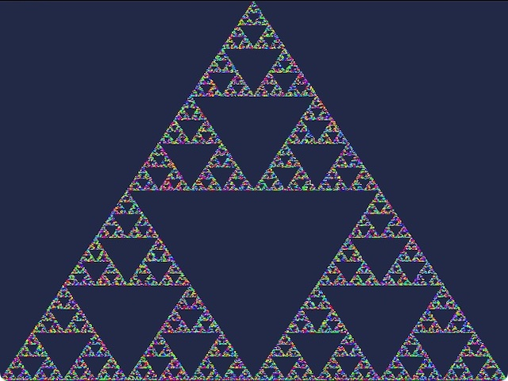

# Rotkäppchen und die drei Tanten

Zu Beginn ein Ausflug in die Welt der Märchen: Rotkäppchen hatte nicht nur eine Großmutter, sondern -- was weniger bekannt ist -- auch drei Tanten, Agathe, Beatrice und Cynthia. Diese wohnten in drei Häusern, die zusammen ein Dreieck bildeten. Wenn Rotkäppchen nicht ihre Großmutter besuchte, dann besuchte sie eine der drei Tanten. Letzten Sonntag jedoch war sie sehr unschlüssig, welche sie besuchen sollte. Sie startete, um Agathe einen Besuch abzustatten. Jedoch genau auf dem halben Weg zu Agathe wurde sie unsicher und überlegte es sich noch einmal. Sie beschloß, eine ihrer drei Tanten aufzusuchen, es könnte auch wieder Agathe, aber auch Beatrice oder Cynthia gewesen sein. Doch es war wie verhext: Jedesmal, wenn sie genau den halben Weg zurückgelegt hatte, wurde sie wieder unsicher und entschloß sich neu, einer ihrer drei Tanten aufzusuchen, möglicherweise die gleiche, möglicherweise eine andere. Und das wieder, und wieder, und wieder …

*William P. Beuamont* nannte es das »Tantenspiel«. Ziel ist es nicht, herauszufinden, welche Tante gewinnt (es kann gar keine gewinnen), sondern welche Figur entsteht, wenn man Rotkäppchens Irrweg visualisiert. Ich habe das einmal mit [TigerJython](http://cognitiones.kantel-chaos-team.de/programmierung/python/tigerjython.html) nachprogrammiert und herausgekommen ist obige Figur, in der Fachliteratur auch als [Sierpinski Dreieck](https://de.wikipedia.org/wiki/Sierpinski-Dreieck) bekannt, benannt nach dem polnischen Mathematiker *Wacław Sierpiński*, der das Fraktal schon 1915 als erster beschrieb.

### Der Quellcode

Normalerweise wird dieses Fraktal mit einem rekursiven Algorithmus erzeugt, aber es geht eben auch mithilfe dieses »Chaos-Spiels«, das *Dietmar Herrmann* 1994 beschrieb:

~~~py title="Rotkäppchen und die drei Tanten" linenums="1"
import gpanel as gp
import colorsys
from random import randint

WIDTH, HEIGHT = 640, 480
radius = 1
x = randint(0, WIDTH)
y = randint(0, HEIGHT)

gp.makeGPanel(gp.Size(WIDTH, HEIGHT))
gp.window(0, WIDTH, HEIGHT, 0)
gp.title("Rotkäppchen und die drei Tanten")
gp.bgColor(gp.Color(33, 41, 70))

for i in range(50000):
    p = randint(0, 2)
    if (p == 0):
        x /= 2
        y = (y + HEIGHT)/2
    elif (p == 1):
        x = (x + WIDTH/2)/2
        y /= 2
    else:
        x = (x + WIDTH)/2
        y = (y + HEIGHT)/2
    gp.move(x, y)
    hue = (i%100)/100.0
    col = colorsys.hsv_to_rgb(hue, 1.0, 1.0)
    gp.setColor(col)
    gp.fillCircle(radius)

print("I did it, Babe!")
~~~

Man sieht sehr schön, wie sich das Dreieck zufällig, aber dennoch erkennbar, zusammensetzt. Je nach zufälligem Startwert liegen die ersten drei bis vier Punkte noch außerhalb des Fraktals, danach geht aber alles seinen geordneten, aber trotzdem chaotischen Gang. Und an den Farben erkennt Ihr, daß auch die Reihenfolge, in der die einzelnen Punkte des Fraktals von Rotkäppchen angelaufen werden, ebenfalls unvorhersehbar sind.

### Verwendete und weiterführende Literatur

- William P. Beaumont: *Conquering the Math Bogeyman*, in Clifford A. Pickover (Ed.): *Fractal Horizons – The Future Use of Fractals*, New York (St. Martin's Press) 1996, Seiten 3-15
- Dietmar Herrmann: *Algorithmen für Chaos und Fraktale*, Bonn (Addison-Wesley) 1994, Seiten 132ff.