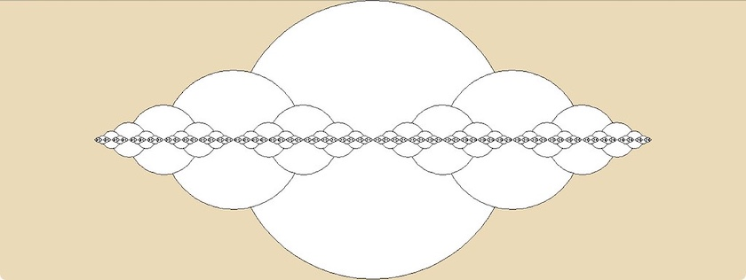
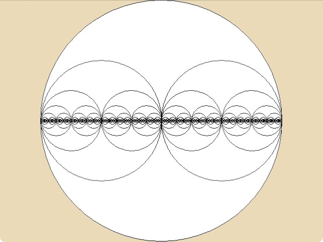
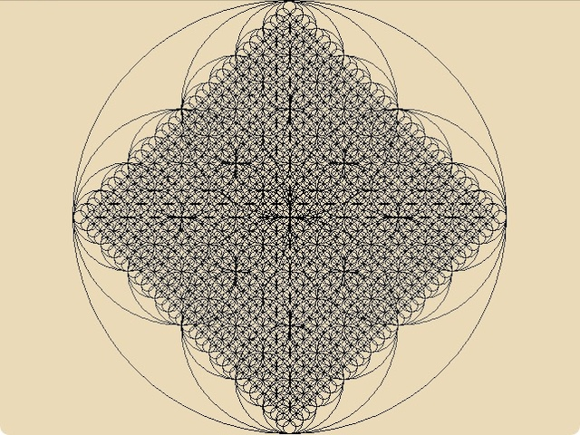

# Shapes

## For Your Eyes Only – TigerJython zieht Kreise

## Cantor-Käse-Konstruktionen

Die [Cantor-Menge](https://de.wikipedia.org/wiki/Cantor-Menge) ist eine überabzählbar mächtige, total unzusammenhängende und nirgends dichte, aber dennoch kompakte Punktmenge, die laut *Ian Stewart*[^1] 1875 von *Henry Smith* entdeckt und von *[Georg Cantor](https://de.wikipedia.org/wiki/Georg_Cantor)* 1883 veröffentlicht wurde. Sie gilt als das älteste Fraktal überhaupt.

[^1]: Ian Stewart: *Spielt Gott Roulette?* Frankfurt/Main und Leipzig (Insel Taschenbuch) 1993, S. 130ff.

Da die Cantor-Menge schwer zu visualisieren ist, wird sie häufig durch eine Figur dargestellt, die aus Kreisen konstruiert wird und zur Cantor-Menge topologisch äquivalent ist. *Clifford A. Pickover* beschreibt sie so[^2]: Aus einem Kreis wird bis auf zwei kleinere Kreise alles entfernt. Aus diesen zwei kleineren Kreisen wird wiederum bis auf zwei kleinere Kreise alles entfernt. Nun hat man schon vier Kreise, aus denen man jeweils bis auf zwei kleinere Kreise alles entfernt. Und so weiter und so fort …

[^2]: Clifford A. Pickover: *Mit den Augen des Computers. Phantastische Welten aus dem Geist der Maschine*, München (Markt und Technik) 1992, S. 171ff.

Entlang des waagrechten Durchmessers (der Horizontalen) ist die fraktale Dimension für die Punktmenge nahezu&nbsp;$1$. Kleinere Fraktale mit einer geringeren Dimension entstehen durch die Verwendung geschrumpfter und getrennter Kreise.

Das schreit natürlich nach einer rekursiven Funktion und die ist in Python/[TigerJython](http://cognitiones.kantel-chaos-team.de/programmierung/python/tigerjython.html) recht schnell erstellt:

~~~py title="Cantor-Käse" linenums="1"
import gpanel as gp

WIDTH = 640
HEIGHT = 480

gp.makeGPanel(gp.Size(WIDTH, HEIGHT))
gp.window(0, WIDTH, HEIGHT, 0)
gp.title("Cantor-Käse")
gp.bgColor(gp.makeColor(234, 218, 184))

def cheese(x, y, r, level):
    gp.move(x, y)
    gp.setColor(gp.makeColor(255, 255, 255))
    gp.fillCircle(r)
    gp.setColor(gp.makeColor(0, 0, 0))
    gp.circle(r)
    if (level > 1):
        cheese(x - r/2, y, r/2, level - 1)
        cheese(x + r/2, y, r/2, level - 1)

cheese(WIDTH/2, HEIGHT/2, HEIGHT/2, 10)

print("I did it, Babe!")
~~~

Wandelt man das Skript ein wenig ab, indem man auf der x-Achse jeweils den Durchmesser ($r$) anstelle der Radii ($\frac{r}{2}$) addiert, respektive subtrahiert,

~~~py linenums="17"
if (level > 1):
    cheese(x - r, y, r/2, level - 1)
    cheese(x + r, y, r/2, level - 1)
~~~

erhält man das Gebilde im Bannerbild oben. Das ist zwar strenggenommen kein Cantor-Käse mehr, sieht aber -- wie ich finde -- auch recht hübsch aus.

Schon bei [früheren Experimenten](http://blog.schockwellenreiter.de/2016/09/2016091601.html) hatte ich mich gefragt, was für eine Figur entstände, wenn man den Käse sich nicht nur in der Horizontalen, sondern auch in der Vertikalen ausbreiten ließe?

~~~py title="Cantor-Käse horizontal und vertikal" linenums="1"
import gpanel as gp

WIDTH = 640
HEIGHT = 480
maxLevel = 6

gp.makeGPanel(gp.Size(WIDTH, HEIGHT))
gp.window(0, WIDTH, HEIGHT, 0)
gp.title("Cantors-Doppelkäse")
gp.bgColor(gp.makeColor(234, 218, 184))

def cheese(x, y, r, level):
    gp.move(x, y)
    # gp.setColor(gp.makeColor(255, 255, 255))
    # gp.fillCircle(r)
    gp.setColor(gp.makeColor(0, 0, 0))
    gp.circle(r)
    if (level > 1):
        cheese(x - r/2, y, r/2, level - 1)
        cheese(x, y - r/2, r/2, level - 1)
        cheese(x + r/2, y, r/2, level - 1)
        cheese(x, y + r/2, r/2, level - 1)

cheese(WIDTH/2, HEIGHT/2, HEIGHT/2, maxLevel)

print("I did it, Babe!")
~~~

Auch dieses Ergebnis sieht recht nett aus, allerdings sollte man hier die Rekursionstiefe kleiner wählen, sonst verschwindent alles hinter einem wüsten [Moiré-Muster](https://de.wikipedia.org/wiki/Moir%C3%A9-Effekt).

### Weiterführende Literatur

- Benoît B. Mandelbrot: *Die fraktale Geometrie der Natur*, Basel, Boston, Berlin (Birkhäuser) 1991. Die Cantor-Menge wird im Kapitel&nbsp;8 (Seiten 86-95) beschrieben.
- Jörg Kantel: *[Cantors Doppelkäse mit Shoes](http://blog.schockwellenreiter.de/2016/09/2016091601.html)*, Der Schockwellenreiter vom 16. September 2016.
- Clifford A. Pickover: *Mit den Augen des Computers. Phantastische Welten aus dem Geist der Maschine*, München (Markt und Technik) 1992. Dem Cantor-Käse ist auf den Seiten 171-181 ein eigenes Kapitel gewidmet.
- Chris Robart (Ed.): *[Programming Ideas: For Teaching High School Computer Programming](https://mmhs.ca/compsci/ideas2.pdf)*, (PDF 260 KB, 2nd Edition) 2001. Eine Fundgrube voller Ideen, deren Download sich in jedem Fall lohnt.
- Ian Stewart: *Spielt Gott Roulette? Uhrwerk oder Chaos*, Frankfurt/Main, Leipzig (Insel Taschenbuch) 1993, Seiten 130-134.
