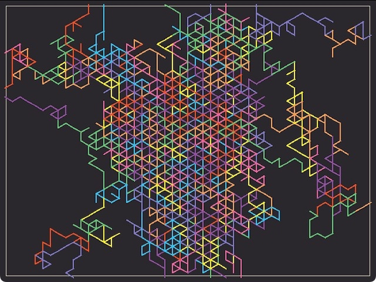
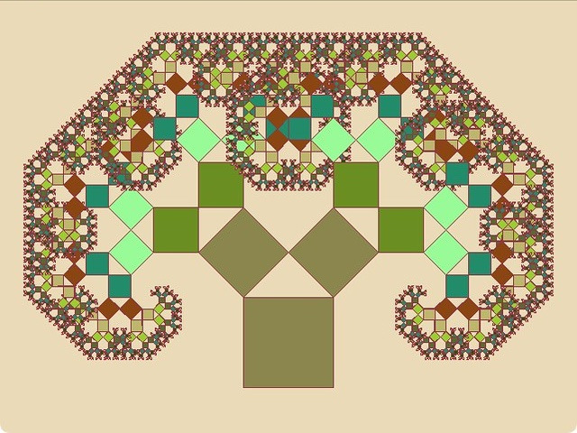
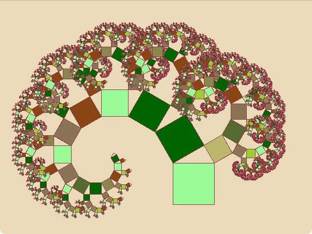

# Zeichnen mit der Schildkröte

## Spaß mit der Turtle: Mandalas nach Joshua Goldstein

## Noch mehr Spaß mit TigerJython: Turtle-Spirale

## Es ist ja alles so quietschebunt hier

## Random Walker

## Pi springt im Dreieck (Random Walk)

## Hexagonaler Random Walk

Der bei Microsoft forschende Psychologe und Informatiker *Dan Goldstein* [berichtet in seinem Blog](https://www.decisionsciencenews.com/?p=6464), wie er mit seiner neunjährigen Tochter in einem Bagel-Shop warten mußte. Um sich die Langeweile zu verkürzen, kramte er ein hexagonal-kariertes Blatt Papier und einen Würfel hervor (Psychologen bei Microsoft haben immer einen hexagonal-karierten Notizblock und einen Würfel in der Tasche). Und dann entschied er, daß, wenn eine Eins gewürfelt wurde, die Tochter auf dem Papier einen Strich nach oben (nach Norden) malen durfte, bei einer Zwei ging es nach Nordost, bei einer Drei nach Südost und so weiter in alle sechs Richtungen, die ein Hexagon erlaubt. Heraus kam ein [Random Walk](https://de.wikipedia.org/wiki/Random_Walk) in sechs Richtungen.

Als ich dies las, dachte ich, daß dies doch ein schönes Projekt für eine Realisierung mit der Turtle sei. Zuerst stellte ich mir die Frage, wie man denn der Schildkröte beibringt, ein Hexagon zu zeichnen. Ein [Blick in die Wikipedia](https://de.wikipedia.org/wiki/Sechseck) half mir weiter, denn dort konnte ich entnehmen, daß die Schildkröte an jedem der sechs Endpunkt einen Winkel von $60°$ einschlagen mußte, entweder konsequent nach rechts oder konsequent nach links. Die sechs Winkel für die sechs möglichen Richtungen sind also $0°$, $60°$, $120°$, $180°$, $240°$ und $300°$. *Brute Force* zeichnet sich ein Hexagon also so:

~~~py linenums="1"
hexi = gt.Turtle(tf)
hexi.setHeading(0)
hexi.forward(100)
hexi.setHeading(60)
hexi.forward(100)
hexi.setHeading(120)
hexi.forward(100)
hexi.setHeading(180)
hexi.forward(100)
hexi.setHeading(240)
hexi.forward(100)
hexi.setHeading(300)
hexi.forward(100)
~~~

Natürlich geht das in einer Schleife viel kompakter und einfacher:

~~~py linenums="1"  
hexi = gt.Turtle(tf)

for in in range(6):
    angle = i*60
    hexi.setHeading(angle)
    hexi.forward(100)
~~~

Für die eigentliche Realisierung in [TigerJython](http://cognitiones.kantel-chaos-team.de/programmierung/python/tigerjython.html) habe ich dann noch auf die bewährte [Coding Train Farbpalette](http://cognitiones.kantel-chaos-team.de/multimedia/farbpaletten/codingtrainfarben.html) zurückgegriffen, damit auch alles schön bunt wird. Außerdem habe ich mit Pythons `randint`-Modul einen Würfel simuiert, der dafür sorgt, daß der Random Walk auf wirklich (pseudo-) zufällig ist:

~~~py linenums="1"
# Roll Dice and set Angle
roll = randint(0, 5)
angle = roll*60
hexi.setHeading(angle)
~~~

Und schießlich habe ich noch als Reminiszenz an *Christian Thompson* (aka *TokyoEdtech*, Ihr wisst schon, der Mann, der Unglaubliches mit Pythons Turtle anstellt) dem Turtle-Playground einen Rand spendiert. Das hat zwar den Quellcode fast verdoppelt, aber er ist immer noch recht kurz geraten:

~~~py title="Hexagonaler Random Walker" linenums="1"
import gturtle as gt
from random import randint

WIDTH, HEIGHT = 640, 480
MIN_X = -WIDTH//2 + 10
MAX_X = WIDTH//2 - 10
MIN_Y = HEIGHT//2 - 10
MAX_Y = -HEIGHT//2 + 10 
BORDERSIZE = 1
STEPSIZE = 15

codingtrain = [makeColor(240, 80, 37), makeColor(248, 158, 80),
               makeColor(248, 239, 34), makeColor(49, 197, 244),
               makeColor(240, 99, 164), makeColor(146, 82, 161),
               makeColor(129, 122, 198),  makeColor(98, 199, 119)]

gt.setPlaygroundSize(WIDTH, HEIGHT)
tf = gt.TurtleFrame()
tf.title = "Hexagonaler Random Walker"
tf.clean(makeColor("#2a282d"))

# Draw Border
border = gt.Turtle(tf)
border.penWidth(BORDERSIZE)
border.setPenColor("#e6e2cc")
border.penUp()
border.hideTurtle()
border.moveTo(MIN_X, MIN_Y)
border.penDown()
border.moveTo(MAX_X, MIN_Y)
border.moveTo(MAX_X, MAX_Y)
border.moveTo(MIN_X, MAX_Y)
border.moveTo(MIN_X, MIN_Y)
border.penUp()

# Start Random Walk
hexi = gt.Turtle(tf)
hexi.hideTurtle()
hexi.penWidth(2)
# hexi.speed(1000)

def goHome():
    hexi.penUp()
    hexi.home()
    hexi.penDown()

for step in range(5000):
    
    # Set Pencolor
    if step%20 == 0:
        c = gt.makeColor(codingtrain[randint(0, len(codingtrain) - 1)])
        hexi.setPenColor(c)
        
    # Roll Dice and set Angle
    roll = randint(0, 5)
    angle = roll*60
    hexi.setHeading(angle)
    
    # Check Border
    if hexi.getX() >= MAX_X:
        goHome()
    elif hexi.getX() <= MIN_X:
        goHome()
    elif hexi.getY() <= MAX_Y:
        goHome()
    elif hexi.getY() >= MIN_Y:
        goHome()
    else:
        hexi.forward(STEPSIZE)

print("I did it, Babe!")
~~~

Und dann habe ich, wenn die Turtle das Spielfeld verlässt, sie wieder nach Hause geschickt (ein wenig wie beim Monopoly-Spiel: »*Gehe nicht über Los und ziehe keine 4.000 Euro ein*«), wo sie ihre Reise wieder neu beginnt. Dadurch wollte ich vermeiden, daß sie irgendwann im Nirwana verschwindet.

### Weiterführende Literatur

Random-Walk-Modelle finden einige interessanten Anwendungen von der Biologie bis zur Finanzwirtschaft. Wer sich da hineinlesen will, findet hier ein paar interessante Beiträge:

- Norbert Henze: *Irrfahrten und verwandte Zufälle. Ein elementarer Einstieg in die stochastischen Prozesse*, Wiesbaden (Springer Spektrum) 2013
- Jake Hofman: *[Simple math for a complex world: Random walks in biology and finance](http://jakehofman.com/talks/dalton_hunter_20071031.pdf)* (Vortragsfolien, PDF), 31.&nbsp;Oktober&nbsp;2007
- Rubin H. Landau: *[Random Walks](https://sites.science.oregonstate.edu/~landaur/INSTANCES/WebModules/5_RandomWalk/RandomWalk.html)*, aus: *[INSTANCES](https://sites.science.oregonstate.edu/~landaur/INSTANCES/index.html) (Incorporating Computational Scientific Thinking Advances into Education & Science Courses)*, Oregon State Univ, Corvallis (Depart of Physics), 2013
- William F. Sharpe, Daniel G. Goldstein und Philip W. Blythe: *[The Distribution Builder: A Tool for Inferring Investor Preferences](https://web.stanford.edu/~wfsharpe/art/qpaper/qpaper.pdf)* (PDF),  10. Oktober 2000

Und auch im oben verlinkten [Original-Blog-Post](https://www.decisionsciencenews.com/?p=6464), der mich zu diesem Beitrag inspirierte, hat *Dan Goldstein* ein paar überraschende Überlegungen zum (hexagonalen) Zufallsspaziergang der Schildkröte angestellt.

## Auf der Suche nach der Mona Lisa in der Kreiszahl Pi

## Die Kochsche Schneeflocke

## Der Baum des Pythagoras

Eine weitere Ikone der fraktalen Geometrie ist der Pythagoras-Baum. Er geht zurück auf den niederländischen Ingenieur und späteren Mathematiklehrer *Albert E. Bosman* (1891–1961). Er entwarf während des 2. Weltkrieges in seiner Freizeit an einem Zeichenbrett, an dem er sonst U-Boot-Pläne zeichnete, geometrische Muster. Seine Graphiken wurden 1957 in dem Buch »*Het wondere onderzoekingsveld der vlakke meetkunde*« veröffentlicht. Der Baum beruht auf einer rekursiven Abbildung des Pythagoras-Lehrsatzes: Die beiden Quadrate auf den Katheten des rechtwinkligen Dreiecks dienen als Verzweigung, auf dem jedes Kathetenquadrat sich wiederum verzweigt.

### Symmetrischer Pythagoras-Baum

~~~py title="Symmetrischer Pythagoras-Baum" linenums="1"
import gturtle as gt
import math

palette = [makeColor(189, 183, 110), makeColor(0, 100, 0),
           makeColor(34, 139, 105), makeColor(152, 251, 152),
           makeColor(85, 107, 47), makeColor(139, 69, 19), 
           makeColor(154, 205, 50), makeColor(107, 142, 35),
           makeColor(139, 134, 78), makeColor(139, 115, 85)]
WIDTH = 640
HEIGHT = 480
maxRec = 2

def tree(s):
    if s < maxRec:
        return
    square(s)
    p.forward(s)
    s1 = s/math.sqrt(2)
    p.left(45)
    tree(s1)
    p.right(90)
    p.forward(s1)
    tree(s1)
    p.back(s1)
    p.left(45)
    p.back(s)
    
def square(s):
    col = palette[int(s - 2)%len(palette)]
    p.setFillColor(col)
    p.startPath()
    for _ in range(4):
        p.forward(s)
        p.right(90)
    p.fillPath()

gt.Options.setPlaygroundSize(WIDTH, HEIGHT)      
tf = gt.TurtleFrame()
tf.setTitle("Symmetrischer Pythagoras-Baum")
tf.clear(makeColor(234, 218, 184))   # Hintergrundfarbe
p = gt.Turtle(tf)
p.setPenColor("#923545")
p.hideTurtle()
p.setPos(-50, -HEIGHT/2 + 50)
tree(100)

print("I did it, Babe!")
~~~

### Asymmetrischer Pythagoras-Baum

~~~py title="Asymmetrischer Pythagoras-Baum" linenums="1"
import gturtle as gt
import math

palette = [makeColor(189, 183, 110), makeColor(0, 100, 0),
           makeColor(34, 139, 105), makeColor(152, 251, 152),
           makeColor(85, 107, 47), makeColor(139, 69, 19), 
           makeColor(154, 205, 50), makeColor(107, 142, 35),
           makeColor(139, 134, 78), makeColor(139, 115, 85)]
WIDTH = 640
HEIGHT = 480

def tree(s, level):
    if level < 1:
        return
    else:
        quadrat(s)
        # Linke Seite
        ls = s*math.sqrt(3)/2
        p.forward(s)
        p.left(90)
        p.forward(s)
        p.right(150)
        p.forward(ls)
        p.left(90)
        tree(ls, level - 1)
        # Rechte Seite
        rs = s/2
        p.right(180)
        p.forward(rs)
        p.left(90)
        tree(rs, level - 1)
        p.left(60)
        p.back(s)
        
def quadrat(s):
    col = palette[int(s - 2)%len(palette)]
    # p.setPenColor(col)
    p.setFillColor(col)
    p.startPath()
    for _ in range(4):
        p.forward(s)
        p.left(90)
    p.fillPath()

gt.Options.setPlaygroundSize(WIDTH, HEIGHT)
gt.Options.setFramePosition(800, 50)       
tf = gt.TurtleFrame()
tf.setTitle("Asymmetrischer Pythagoras-Baum")
tf.clear(makeColor(234, 218, 184))   # Hintergrundfarbe
p = gt.Turtle(tf)
p.setPenColor("#923545")
p.hideTurtle()
p.setPos(120, -HEIGHT/2 + 60)
tree(85, 14)

print("I did it, Babe!")
~~~

Im Prinzip liegen die Unterschiede in den beiden Versionen nur in der Funktion `tree()`, allerdings muß sich die Schildkröte in der Funktion `square()` resepektive `quadrat()` beim symmetrischen Pythagoras-Baum vom Startpunkt aus nach **rechts** (`p.right(90)`) und bei der asymmetrischen Variante nach **links** (`p.left(90)`) bewegen.

### Weiterführende Literatur

- Einen rekursiven Algorithmus gibt es in einem Pascal-Programm aus Jürgen Plate: *Computergrafik: Einführung – Algorithmen – Programmentwicklung*, München (Franzis) 2. Auflage 1988, Seiten 460-462.
- Dazu vergleiche auch: Jörg Kantel: *[Tutorial: Einen Pythagoras-Baum mit der NodeBox zeichnen](http://blog.schockwellenreiter.de/2017/11/2017111902.html)*, Schockwellenreiter vom 19. November 2017 und *[Wochenendspaß mit Processing.py: Der Baum des Pythagoras](http://blog.schockwellenreiter.de/2017/02/2017020402.html)*, Schockwellenreiter vom 4. Februar 2017.
- Die Geschichte des Baumes steht in dem schon mehrfach erwähnten Buch von Dietmar Herrmann, *Algorithmen für Chaos und Fraktale*, Bonn (Addison-Wesley) 1994 auf den Seiten 170f.
- Jarka Arnold, Tobias Kohn, Aegidius Plüss: *[Programmierkonzepte mit Python und der Lernumgenbung TigerJython](https://programmierkonzepte.ch/index.php)*, Version 2.77, Letzte Aktualisierung: 1. Juni 2024
- Jarka Arnold, Aegidius Plüss: *[Grafik, Robotik, Datenbanken und Spielprogrammierung mit TigerJython](https://www.jython.ch/index.php)* (TigerJython für Gymnasien), Version 2.5, Letzte Aktualisierung: 12. Juli 2024
