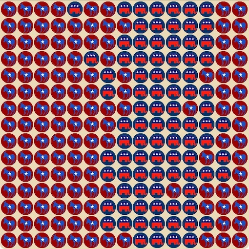

# Simulationen mit zellulären Automaten

## Die Mathematik der Demokratie: Das Wahlspiel mit dem Tiger und der Schlange

Spätestens seit der Wiederwahl von *Donald Trump* zum Präsidenten der USA fragen sich ja etliche, wie es dort mit der Demokratie bestellt sei. Und womit? Mit Recht! Dazu passend ein Spiel, das *Peter Donelly* vom *University College of Swansea* in Wales und *Domenic Welsh* von der *Oxford University* schon in den 80er Jahren des letzten Jahrhunderts untersucht hatten. Populär wurde es dann durch eine Veröffentlichung von *Alexander K. Dewdney* in der *Scientific American* und in der deutschen Schwesterzeitschrift *Spektrum der Wissenschaft*. Er nannte das Spiel »WAEHLER«:

In diesem Spiel werden die Felder eines rechteckigen Feldes (im obigen Screenshot 15 x 15 Felder) zuerst wahllos mit den Symbolen der Republikaner (Elephant) oder der Demokraten (Esel) besetzt. Das widerspiegelt die politische Einstellung der »Einwohner« dieses »Planeten«. Bei jedem Spielzug wird nun ein Einwohner in seiner politischen Meinung schwankend und nimmt die Einstellung eines seiner zufällig herausgegriffenen Nachbarn an (falls er nicht sowieso schon dessen Meinung war).

Als Nachbarschaft gilt hier die [Moore-Nachbarschaft](http://cognitiones.kantel-chaos-team.de/programmierung/softcomputing/moorenb.html), also alle 8 Nachbarfelder. Die Randbedingungen sind periodisch, das heißt jeder Spieler auf einem Randfeld hat »Nachbarn« auf der gegenüberliegenden Seite, die Spieler in den Eckfeldern sogar auf beiden gegenüberliegenden Seiten. Unser Spielfeld nimmt daher die Form eines Reifens oder eines Torus an, wie zum Beispiel auch in der populären Simulation [WATOR](https://de.wikipedia.org/wiki/Wator).

Nun passiert Folgendes: Aus der anfänglich wüsten Verteilung bilden sich im Laufe des Spiels feste Inseln einer Meinung heraus. Und im Endeffekt gewinnt eine Partei die alleinige Herrschaft. Das geschieht manchmal sehr schnell, manchmal dauert es länger, weil sich einige Inseln des Widerstands hartnäckig halten, aber das Endergebnis ist immer gleich: Der Planet wird entweder komplett von Eseln oder komplett von Dickhäutern regiert. Ob das der Sinn einer Demokratie ist?

Das Spiel ist verwandt mit dem Selektions-Spiel, das *Ruthild Winkler* und *Manfred Eigen* schon 1975 in ihrem Buch »Das Spiel« vorgestellt hatten. Auch wenn die Regeln leicht abgewandelt sind, das Ergebnis ist stets das gleiche. Es überlebt immer nur eine Partei. Das ändert sich übrigens auch nicht, wenn man das Feld mit mehr als zwei Parteien beim Start füllt. Also ist nicht das amerikanische Wahlsystem die alleinige Ursache des Übels.

### Der Code

Der [TigerJython](http://cognitiones.kantel-chaos-team.de/programmierung/python/tigerjython.html)-Code ist *straight forward*. Lediglich die Behandlung der Randbedingungen ist allgemeiner gehalten, als unbedingt nötig. Damit sind bei Abwandlungen auch andere Nachbarschaften als die Moore-Umgebung möglich. Er folgt einem [Processing- (Java-)](http://cognitiones.kantel-chaos-team.de/programmierung/creativecoding/processing/processing.html) Code, den ich [vor Jahren schon einmal programmiert](http://cognitiones.kantel-chaos-team.de/programmierung/creativecoding/processing/demokratiespiel.html) hatte.

~~~py title="waehler.py" linenums="1"
import gpanel as gp
import os
from random import randint

DATAPATH = os.path.join(os.path.dirname(os.path.abspath(__file__)), "data")

# Konstanten
REP = 0
DEM = 1
NCOLS = 15   # 10 oder 20
NROWS = 15   # 10 oder 20
W = H = 34
WIDTH  = NCOLS*W
HEIGHT = NROWS*H
MAXRUNDEN = 8000   # 2000 oder 20000

# (globale) Variablen
nReps = nDems = 0
repImg = gp.getImage(os.path.join(DATAPATH, "rep.png"))
demImg = gp.getImage(os.path.join(DATAPATH, "dem.png"))
grid = []
keepGoing = True
runde = 0

gp.makeGPanel(gp.Size(WIDTH, HEIGHT))
gp.window(0, WIDTH, 0, HEIGHT)
gp.windowPosition(1200, 50)
gp.bgColor(gp.Color(234, 218, 184))   # Packpapier
gp.title("Wähler.py: Das Demokratie-Spiel")
gp.enableRepaint(False)

# Initialize Spielfeld
for x in range(NROWS):
    grid.append([])
    for y in range(NCOLS):
        grid[x].append(randint(0, 1))
        if grid[x][y] == REP:
            nReps += 1
            gp.image(repImg, x*W, y*H)
        else:
            nDems += 1
            gp.image(demImg, x*W, y*H)
print("Start: Demokraten = " + str(nDems) +
      ", Republikaner = " + str(nReps))

# Simulationsscheife
while keepGoing:
    runde += 1
    # Zufällig einen Wähler heraussuchen
    waehlerX = randint(0, NROWS - 1)
    waehlerY = randint(0, NCOLS - 1)
    # Zufällig einen Nachbarn heraussuchen 
    auswahl = randint(0, 7)   # (Moore-Umgebung)
    if auswahl == 0:
        nachbarX = waehlerX
        nachbarY = waehlerY - 1
    elif auswahl == 1:
        nachbarX = waehlerX + 1
        nachbarY = waehlerY - 1
    elif auswahl == 2:
        nachbarX = waehlerX + 1
        nachbarY = waehlerY
    elif auswahl == 3:
        nachbarX = waehlerX + 1
        nachbarY = waehlerY + 1
    elif auswahl == 4:
        nachbarX = waehlerX
        nachbarY = waehlerY + 1
    elif auswahl == 5:
        nachbarX = waehlerX - 1
        nachbarY = waehlerY + 1
    elif auswahl == 6:
        nachbarX = waehlerX - 1
        nachbarY = waehlerY
    elif auswahl == 7:
        nachbarX = waehlerX - 1
        nachbarY = waehlerY - 1
    else:    # Notausgang
        print("Irgend etwas ist gewaltig schiefgelaufen!")
        
    # Prüfung der Ränder
    if nachbarX < 0:
        nachbarX = NROWS + nachbarX
    nachbarX = nachbarX % NROWS
    if nachbarY < 0:
        nachbarY = NCOLS + nachbarY
    nachbarY = nachbarY % NCOLS
    
    # Neuzeichnen des Spielfelds
    if grid[nachbarX][nachbarX] == DEM:
        if grid[waehlerX][waehlerY] != DEM:
            nDems += 1
            nReps -= 1
        grid[waehlerX][waehlerY] = DEM
        gp.image(demImg, waehlerX*W, waehlerY*H)
    else:
        if grid[waehlerX][waehlerY] != REP:
            nReps += 1
            nDems -= 1
        grid[waehlerX][waehlerY] = REP
        gp.image(repImg, waehlerX*W, waehlerY*H)
    gp.repaint()
    print("Runde: ", str(runde) + ",Demokraten = " + str(nDems) +
          ", Republikaner = " + str(nReps))
    gp.delay(1)
    if (nReps <= 0) or (nDems <= 0) or (runde >= MAXRUNDEN):        
        keepGoing = False

print("Ende der Simulation!")
~~~

Wer das Spiel selber nachprogrammieren möchte, hier gibt es auch noch die beiden Icons für die Republikaner (Elephant) und Demokraten (Esel):

&nbsp;

### Caveat

Ungeduldige sollten erst einmal mit einem 10x10-Gitter beginnen. Dann hat man in der Regel schnell ein Ergebnis. Ich hatte auf diesem kleinen Gitter auch schon nach unter 2.000 Runden die absolute Herrschaft einer Partei erreicht. Auf einem 20x20-Gitter hingegen ist die Demoratie oft sehr hartnäckig, hier kann es durchaus auch mal 200.000 Runden und mehr dauern, bis die Diktatur kommt. Aber auf so einem großen Spielfeld erkennt man natürlich die stabilen »Inseln gleicher Meinung« sehr viel besser.

Es gibt sicher einen Schwellwert, der – wenn unterschritten – kein zurück zur Macht mehr erlaubt. Aber er ist sehr klein: Ich habe es schon erlebt, daß Parteien, die unter die 10-Prozent-Marke gerutscht waren, sich wieder berappelten und im Endeffekt doch noch die Macht ergriffen.

### Weiterführende Literatur

- A.K. Dewdney: *Wie man π erschießt. Fünf leichte Stücke für WHILE-Schleifen und Zufallsgenerator, oder: lebensechte Simulationen von Zombies, Wählern und Warteschlangen*, in: Immo Diener (Hg.): *Computer-Kurzweil*, Heidelberg (Spektrum der Wissenschaft, Reihe: Verständliche Forschung) 1988
- Manfred Eigen, Ruthild Winkler: *Das Spiel. Naturgesetze steuern den Zufall*, München (Piper), 1975 (unveränderte Taschenbuchausgabe 1985)
- George G. Szpiro: *Die verflixte Mathematik der Demokratie*, Berlin und Heidelberg, Zürich (Springer, Verlag Neue Züricher Zeitung) 2011

